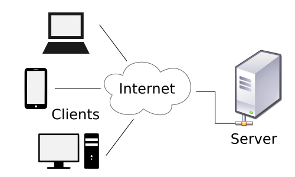

# CSCI 2254 Web App Development#

### Spring 2017###

**R. Muller**

---

###Lecture Notes: 1###

####Today####

1. Overview
2. Course Administration

3. CSS

---

#### 1. Overview####

This is a 2000-level CS course covering web application development. The goal of the course is to teach web application development using modern technology in such a way that you will be able to develop great applications and that you will be well-prepared for the fast-evolving world of web app development in industry. On this latter point, web app technology had evolved rapidly and there are many production systems developed with obsolete technology. This course attempts to prepare you to move forward, but you should leave the course reasonably well-prepared to work with legacy systems.

We assume that you've learned to code in some high-level programming language such as Python, Java, C or OCaml. Hopefully you've completed CS1101 (or better yet, CS1103!) and maybe even CS1102. But completion of one of those courses isn't a prerequisite, we only assume the ability to code.

Developing good web application is challenging. There are many more issuses that need to be addressed over and above what an "ordinary" app might face. Web applications are [Client/Server Applications](https://en.wikipedia.org/wiki/Client%E2%80%93server_model).

The server (i.e., the **backend**) on the right is serving up web pages and data to a potentially large number of clients over the internet. The clients (i.e., the **frontends**) are typically web browers operated by human beings. They're reading text, looking at images, listening to audio, watching videos, filling out forms, clicking buttons, entering credit card numbers etc etc. On the client side, the web app developer has to put a clear and intuitive, and yes *beautiful*, web site in front of the user. The web app has to respond quickly and correctly to their actions and has to be designed with a logical and intuitve feel.

On the server side, the web application has to serve up data correctly and as quickly as possible. The back end is usually working with a database of some sort, often SQL or NoSQL. It has to be able to degrade gracefully when fielding a flood of requests from large numbers of clients. And it has to fail well when it cannot meet the requests.

#### Languages####

The world of web applications would be easier if it had been designed with knowledge of the requirements. Unfortunately, that's not how it developed. In this course we will emphasize three imperfect languages that are at the core of web app development:

1. **HTML5** — the most recent standard for [HyperText Markup Language](https://en.wikipedia.org/wiki/HTML), the language used to lay out the web page that will appear in a web browser;
2. **CSS3** — the most recent standard for [Cascading Sytle Sheets (CSS)](https://en.wikipedia.org/wiki/Cascading_Style_Sheets), a language that was developed to meet deficiencies in HTML;
3. **JavaScript** (aka **JS**) the programming language developed in the mid 1990s by Brendan Eich when he worked at Netscape and they realized that web pages actually had to be programmable.

The evolution of web application development has been a process of discovery — if we started out with a clean slate today, we would probably have just one integrated web-development programming language that would address all of the issues handled by HTML5, CSS3 and JS in one clean system. (Such languages exist, but they aren't yet mainsteam.)

#### Frameworks####

The word "framework" is common in conversations about web app development. The meaning of the word varies from one place to another. Generally speaking, in the world of web apps it means: a library used by coders using a particular programming language (usually JS) together with coding styles and conventions and possibly some syntactic extensions/annotations to the language that have to be resolved by some sort of *preprocessor* — a program that accepts programs in the extended form of the language and which produces programs in the plain old language.

#### Example####

See the Gettysburg example linked from the schedule in the main GitHub page.

#### Administration####

In addition to learning state of the versions of HTML, CSS, JS and modern frameworks such as React and Vue, we'll be using GitHub to distribute and collect materials in the course. We'll discuss git and GitHub next time.

Please see the course syllabus for details on topic order, grading and other course policies.

