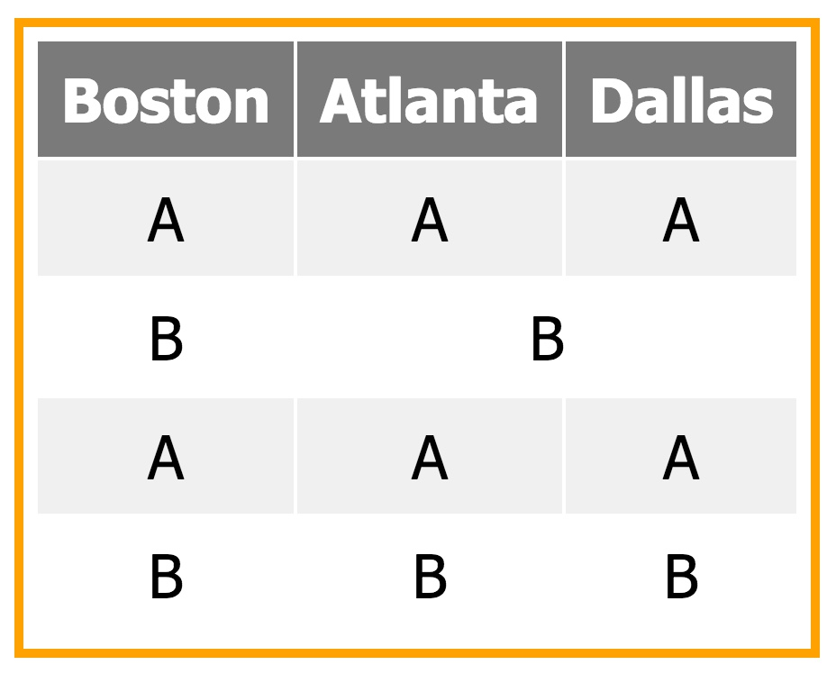

# CSCI 2254 Web App Development#

### Spring 2017###

**R. Muller**

---

###Lecture Notes: 3###

####Today####

1. Markdown
2. More HTML: Lists, Tables, Div, Span
3. CSS

---

#### 1. Markdown####

There are various ways to author web pages with less markup than is required in HTML. These markdown languages don't have all of the features of HTML but they're much easier to write. GitHub markdown is quite popular. The document that you're viewing was written using GitHub  markdown. GitHub renders .md files as HTML and by default will open and render a **README.md** file if it finds one in a repository folder.

```
README.md
```

Examples

```
#Section#           : rendered as an H1
##Subsection##      : rendered as an H2
**something**       : rendered in boldface
---                 : renders a thick horizontal rule
​```code```          : a code block with nice syntax highlighting
| A | B |
|:--:| :--: |       : makes a table
[linkname](url)     : makes a hyptertext link
```

See the [Markdown Cheatsheet](https://github.com/adam-p/markdown-here/wiki/Markdown-Cheatsheet) for more information.


#### 2. More HTML: Lists, Tables, Divs and Spans####

There are a number of ways to make **lists**.

```html
<ol>                : ordered list
  <li>Apple</li>
  <li>Banana</li>
  <li>Lime</li>
</ol>

<ul>                : unordered list
  <li>Apple</li>
  <li>Banana</li>
  <li>Lime</li>
</ul>

<dl>                : description list
  <dt>Coffee</dt>
  <dd>Black hot drink</dd>
  <dt>Milk</dt>
  <dd>White cold drink</dd>
</dl>
```

**Tables**

The following css styling:

```css
table { font:20pt tahoma;
        margin: 100px 100px;
        border:4px solid orange;
        text-align:center;
        padding:5px;
       }

th, td { padding:10px }

th { background:#7A7A7A; color:white }

tr:nth-child(even) { background:#F0F0F0 }
```

Used with

```html
<table>
  <tr> <th>Boston</th> <th>Atlanta</th> <th>Dallas</th> </tr>
  <tr> <td>A</td><td>A</td><td>A</td> </tr>
  <tr> <td>B</td><td colspan=2>B</td> </tr>
  <tr> <td>A</td><td>A</td><td>A</td> </tr>
  <tr> </tr><td>B</td><td>B</td><td>B</td> </tr>
</table>
```

Produces this image



