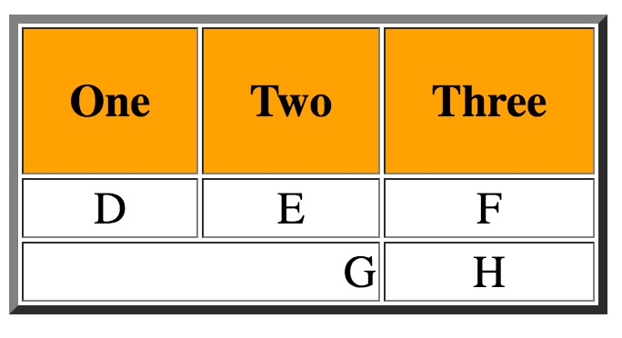
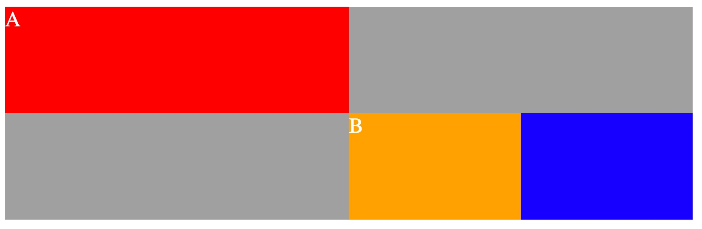

# CSCI 2254 Web App Development

## Problem Set 1: Getting Started

#### (10 Points)

---

Most of the work in this course will involve writing code related to web applications. We'll be using HTML, CSS and JavaScript as our main implementation languages; we'll be using GitHub for distributing harness code, for project collaboration and for submission of work and we'll be using a few popular tools and web frameworks.

This first problem set is designed to help you get your programming environment set up and to get you started on learning the basics of HTML, CSS and JavaScript.

### Work Flow

The basic flow of work for the course will be the following:

1. You'll receive the URL of a problem set repository, say XYZ, via email. The repository will be stored on GitHub. You'll use the unix `git clone` command (or the appropriate GitHub GUI) on your local machine to clone the repository to an appropriately placed directory on your computer. If you're using the Unix command line, you'll type something like:

   ```bash
   > cd /pathto/cs2254/
   > git clone XYZ
   ...
   ```

2. You'll use an editor to design, develop and test your solution. You should commit your work to your local git repository periodically. When your work is ready to submit, you'll transfer your local working repository to a problem set repository on the GitHub course website that the course staff shares with you (and your partner if you have one).  This upload is done with `git push`. If you're using the Unix command line:

   ```bash
   > cd /pathto/cs2254/XYZ
   > git push
   ...
   ```

   If you're using one of the GitHub GUI's, you push your work using the GUI interface instead. After reviewing your work we'll leave comments and record your problem set score in **the local BC gradebook on Canvas**.

---

## Part 0: Invitations##

If you don't already have a GitHub account, the first order of business is to make one. It's quite simple, just google it. If you're using a Windows machine, you'll also want to download GitHub's GUI App for Windows.

Once you've signed up for GitHub, please send EVERYONE on the course staff your GitHub ID. We'll then send you an invitation to join the @BC-CSCI2254 GitHub group. After you've accepted this invitation, you'll have access to our GitHub Classroom and you'll be able to pull the coursework down that we've posted to the GitHub site.

You should also have received an invitation to join the class Piazza forum. If you haven't please let us know.

Please take care of these 2 items as soon as possible.

---

## Part 1: System Configuration

**Installing Atom** Google "download atom" and follow the installation steps. If you're successful, you should be able to fire up the atom editor either by clicking the icon or from the unix command shell by typing:

```bash
   > atom .
```

   If this doesn't work for you, see a course staffer. Atom has

### Wrapping Up###

Whether you're using a Mac or a Windows system, your workflow should be the same:

1. You'll use atom to edit your HTML, CSS and/or JS code;
2. When you think your code is in a good state you'll test it out by loading the main .html file into a web browser;
3. When the code is working (and looks great!) you can submit your work by pushing it your GitHub repository. (If you're using Unix, this would be a `git push`.

---

## Part 2: HTML and CSS##

#### Problem 1 (3 points)####

Create a file **one.html** that generates the following HTML table. Note that the header cells each have 20 pixel padding.




#### Problem 2 (3 points)####

Create a file **two.html** that generates the following image.


#### Problem 3 (4 points)####

Create a file **three.html** that generates the following image consisting of 4 divs.




